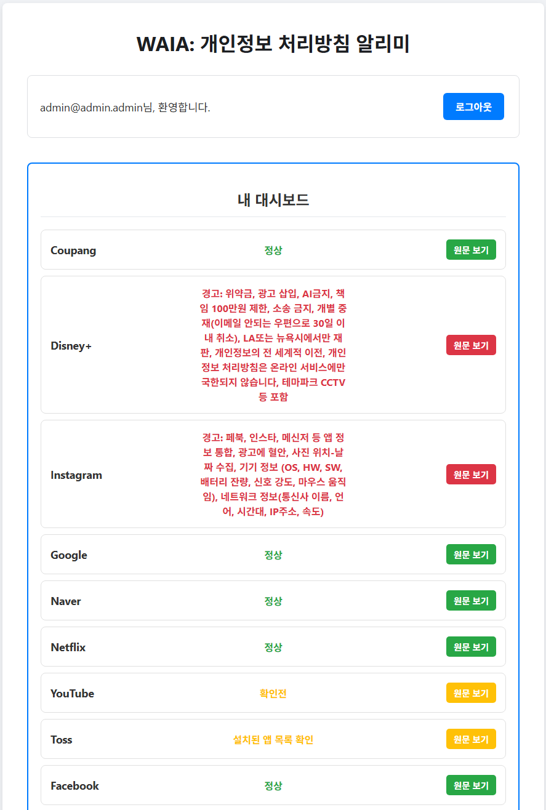

# WAIA - 개인정보 처리방침 알리미

**W**here **A**m **I** **A**greeing?의 약자로, 사용자가 이용하는 여러 웹 서비스의 개인정보 처리방침 상태를 추적하고, 변경 또는 문제 발생 시 알림을 받기 위한 웹 애플리케이션 프로토타입입니다.

---

## ✨ 핵심 기능

- **사용자 인증**: 이메일과 비밀번호를 사용한 회원가입 및 로그인 기능을 제공합니다.
- **서비스 목록**: 등록된 전체 온라인 서비스 목록을 보여줍니다.
- **팔로우/언팔로우**: 사용자는 원하는 서비스를 팔로우하거나 언팔로우할 수 있습니다.
- **개인 대시보드**: 내가 팔로우하는 서비스만 모아보고, 각 서비스의 상태(예: '정상', '주의 필요')를 한눈에 확인할 수 있습니다.
- **반응형 UI**: 서비스 목록을 클릭하여 쉽게 팔로우/언팔로우 할 수 있으며, 상태에 따라 동적으로 UI가 변경됩니다.

---

## 🛠️ 기술 스택

- **Frontend**: 순수 HTML, CSS, JavaScript (Vanilla JS)로 구현되었습니다.
- **Backend & Database**: Firebase를 사용하여 다음 서비스를 활용합니다.
    - **Firebase Authentication**: 사용자 인증 처리
    - **Firestore**: 서비스 목록 및 사용자 데이터 저장

---

## 🚀 시작하기

이 프로젝트를 로컬 환경에서 실행하려면 다음 단계를 따르세요.

1.  **Firebase 프로젝트 생성**
    - [Firebase 콘솔](https://console.firebase.google.com/)로 이동하여 새 프로젝트를 생성합니다.
    - 프로젝트 설정에서 웹 앱(</>)을 추가하고 `firebaseConfig` 객체를 복사합니다.

2.  **프로젝트 설정**
    - 이 저장소를 클론하거나 다운로드합니다.
    - `app.js` 파일을 열어 최상단에 있는 `firebaseConfig` 변수에 복사한 내용을 붙여넣습니다.

3.  **인증 및 데이터베이스 설정**
    - Firebase 콘솔의 **Authentication** -> **Sign-in method** 탭에서 '이메일/비밀번호' 제공업체를 활성화합니다.
    - **Firestore Database**에서 데이터베이스를 생성하고, `services`라는 이름의 컬렉션을 만듭니다. (초기 데이터는 아래의 '서비스 일괄 추가' 기능을 이용하면 편리합니다.)

4.  **애플리케이션 실행**
    - `index.html` 파일을 웹 브라우저에서 엽니다.

---

## 💡 사용법

### 서비스 일괄 추가

`app.js` 파일 하단에는 여러 서비스를 Firestore에 쉽게 추가할 수 있는 헬퍼 함수 `addServicesBatch()`가 포함되어 있습니다.

1.  `app.js` 파일의 `servicesToAdd` 배열에 추가하고 싶은 서비스 목록을 수정합니다.
2.  브라우저에서 앱을 연 뒤, 개발자 도구(F12)의 콘솔 창에 `addServicesBatch()`를 입력하고 실행합니다.
3.  페이지를 새로고침하면 추가된 서비스 목록을 확인할 수 있습니다.

---

## 🔮 다음 계획

- **처리방침 자동 크롤링**: 각 서비스의 개인정보 처리방침 페이지를 주기적으로 크롤링하여 변경점을 자동으로 감지하는 기능.
- **이메일 알림**: 서비스 상태에 '주의 필요' 등급이 매겨지면 해당 서비스를 팔로우하는 사용자에게 이메일 알림을 보내는 기능.
- **팔로워 수 트래킹**: 각 서비스가 몇 명의 사용자에게 팔로우되고 있는지 집계 및 표시.
